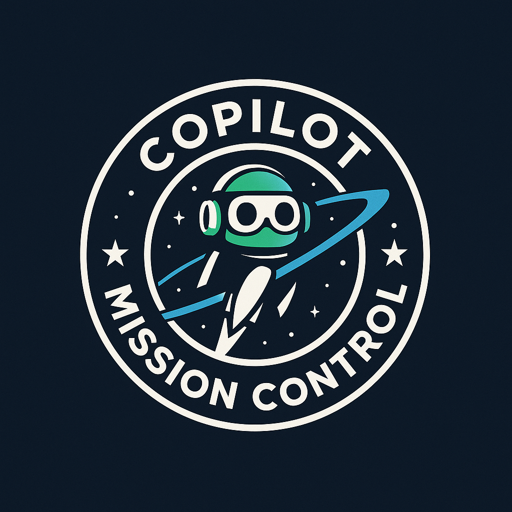

# Copilot Mission Control 🚀
*Your central command for mastering GitHub Copilot, Agents, Edits, Chat, MCP, and more.*



This repo contains organized demos grouped by Copilot mode and focus area. 
The current release includes backend-focused demos, with frontend and MCP content coming soon.

---

## 📂 Folder Structure

```
copilot-mission-control/
│
├── README.md
├── .gitignore
├── docs/
│   ├── overview.md
│   ├── tips-and-tricks.md
│   └── faq.md
│
├── assets/
│   └── mission-control-logo.png
│
├── chat/
│   └── codebase-explain-backend/
│       ├── README.md
│       └── prompts/
│           └── explain-codebase.md
│
├── edits/
│   └── backend-safe-refactors/
│       ├── README.md
│       └── prompts/
│           └── refactor-validations.md
│
├── integrations/
│   └── ci-cd/
│       └── backend-test-and-observability/
│           ├── README.md
│           └── snippets/
│               ├── sample-ci-notes.md
│               └── curl-health.txt
│
├── agents/
│   └── backend-e2e-automation/
│       ├── README.md
│       └── prompts/
│           └── status-update-mission.md
│
├── backend/
│   ├── WrightBrothersApi/
│   └── WrightBrothersApi.Tests/
│
└── frontend/
    └── README.md
```

---

## 🛰 About
Copilot Mission Control is designed to make it easy to demo and learn GitHub Copilot capabilities in a structured way. 
Each demo explains why it matters, which Copilot mode to use, and gives detailed steps for reproducibility.

---

## 📋 Current Demo Categories

### Chat
- **[Codebase Explain, Backend](chat/codebase-explain-backend/)**  
  Use Copilot Chat to explore the Wright Brothers API, understand its structure, and plan follow-up demos.

### Edits
- **[Backend, Safe Refactors](edits/backend-safe-refactors/)**  
  Apply small, safe changes with Copilot Edits while maintaining behavior and readability.

### Integrations
- **[Backend Tests and Observability](integrations/ci-cd/backend-test-and-observability/)**  
  Enhance backend health checks, structured logs, and test coverage with Copilot.

### Agents
- **[Backend E2E Automation](agents/backend-e2e-automation/)**  
  Use Copilot Agent Mode to deliver an end-to-end backend feature with coordinated code, tests, and documentation.

---

## 🔮 Coming Soon
- **Frontend Demos** – React + API integration, UI refactors, accessibility improvements
- **MCP Demos** – Model Context Protocol integrations for live data and advanced workflows

---

## 🛠 How to Use
1. Clone this repo  
2. Open in VS Code with GitHub Copilot Chat, Edits, and Agent Mode enabled  
3. Pick a demo and follow its README  
4. Use the prompts exactly as given, or adapt them to your own project

---

## 📡 Mission Status
- **Backend Demos**: ✅ Ready
- **Frontend Demos**: 🔄 In progress
- **MCP Demos**: 🔄 In progress
